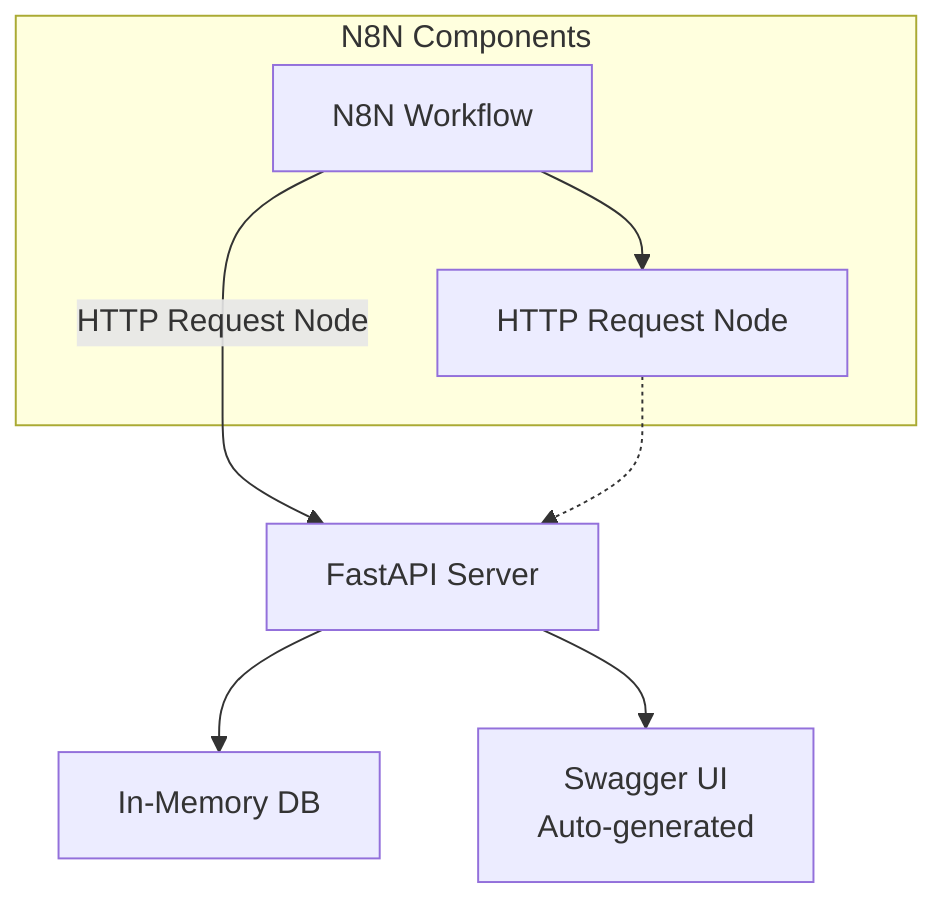

# System Patterns: アーキテクチャとデザインパターン

## システムアーキテクチャ

### 全体構成



### レイヤードアーキテクチャ

#### 1. プレゼンテーション層 (Presentation Layer)

- **FastAPI ルーター**: HTTP エンドポイントの定義
- **HTML レスポンス**: シンプルなフロントエンド
- **Swagger UI**: 自動生成 API ドキュメント

#### 2. アプリケーション層 (Application Layer)

- **エンドポイント関数**: ビジネスロジックの実装
- **リクエスト/レスポンス処理**: データ変換と検証
- **エラーハンドリング**: 基本的な例外処理

#### 3. データ層 (Data Layer)

- **In-Memory ストレージ**: `items_db = []` による単純なデータ保存
- **データモデル定義**: Pydantic BaseModel による型定義

## 採用されたデザインパターン

### 1. MVC パターン (軽量版)

```python
# Model: Pydantic BaseModel
class Item(BaseModel):
    name: str
    description: Optional[str] = None
    # ...

# View: FastAPI response
@app.get("/items")
async def get_items():  # Controller
    return {"items": items_db}  # View
```

### 2. DTO (Data Transfer Object) パターン

```python
class Item(BaseModel):      # DTO for item operations
class Message(BaseModel):   # DTO for message processing
```

**利点**:

- 型安全性の確保
- 自動的なデータ検証
- API スキーマの自動生成

### 3. Repository パターン (簡略版)

```python
# データアクセスの抽象化（現在は in-memory）
items_db = []  # Simple in-memory repository

# 将来的には以下のような拡張が可能
# class ItemRepository:
#     def get_all(self) -> List[Item]
#     def create(self, item: Item) -> Item
```

### 4. Dependency Injection (FastAPI 標準)

```python
# FastAPI の DI 機能により、将来的な拡張が容易
# from fastapi import Depends
#
# def get_db():
#     return database_connection
#
# @app.get("/items")
# async def get_items(db = Depends(get_db)):
```

## API 設計原則

### RESTful 設計

```
GET    /items       - 全アイテム取得 (Collection)
POST   /items       - アイテム作成 (Collection)
GET    /items/{id}  - 特定アイテム取得 (Resource)
PUT    /items/{id}  - アイテム更新 (Resource)
DELETE /items/{id}  - アイテム削除 (Resource)
```

### リソース指向 URL 設計

- **名詞ベース**: `/items` (動詞ではなく名詞)
- **階層構造**: リソースの関係性を URL で表現
- **一意識別**: ID による特定リソースへのアクセス

### HTTP ステータスコード規約

- `200`: 成功 (GET, PUT)
- `201`: 作成成功 (POST)
- `404`: リソース未発見
- `500`: サーバーエラー

## 技術スタックの選択理由

### FastAPI

```python
app = FastAPI(
    title="N8N Python Server",
    description="FastAPIを使用したシンプルなAPIサーバー",
    version="1.0.0"
)
```

**選択理由**:

- 高性能 (Starlette + Pydantic)
- 自動 API ドキュメント生成
- 型ヒントのネイティブサポート
- 非同期処理対応

### Pydantic V2

```python
class Item(BaseModel):
    name: str
    description: Optional[str] = None
    price: float
    is_available: bool = True
```

**選択理由**:

- 自動データ検証
- JSON Schema 自動生成
- 型安全性の確保
- パフォーマンス向上 (V2)

### Uvicorn ASGI Server

```python
uvicorn.run(
    "main:app",
    host="0.0.0.0",
    port=8000,
    reload=True
)
```

**選択理由**:

- 高性能 ASGI サーバー
- 開発時の自動リロード
- プロダクション対応

## 拡張パターンと将来の設計

### データベース統合パターン

```python
# 現在: In-memory
items_db = []

# 将来: Database integration
# from sqlalchemy import create_engine
# from databases import Database
#
# database = Database("postgresql://...")
```

### 認証・認可パターン

```python
# OAuth2/JWT 統合例
# from fastapi.security import OAuth2PasswordBearer
#
# oauth2_scheme = OAuth2PasswordBearer(tokenUrl="token")
#
# @app.get("/protected")
# async def protected_route(token: str = Depends(oauth2_scheme)):
```

### ログ・監視パターン

```python
# 構造化ログ
# import structlog
# logger = structlog.get_logger()
#
# @app.middleware("http")
# async def log_requests(request, call_next):
#     logger.info("request_started", path=request.url.path)
```

## ツール開発アーキテクチャ ⭐ NEW

### ツールエコシステム設計パターン

#### 1. 自己完結型 Import パターン

```python
#!/usr/bin/env python3

import sys
import os

# プロジェクトルートをPythonパスに追加
project_root = os.path.dirname(os.path.dirname(os.path.dirname(os.path.abspath(__file__))))
sys.path.insert(0, project_root)

from tools.utils.url_utils import get_url_content  # noqa: E402

def main():
    """メイン関数"""
    # コマンドライン処理
    pass

if __name__ == "__main__":
    main()
```

**利点**:

- 環境変数 PYTHONPATH 不要
- どのディレクトリから実行しても動作
- 依存関係が自己完結

#### 2. Python パッケージ構造パターン

```
tools/
├── __init__.py              # パッケージ定義
├── utils/                   # 共通ユーティリティ
│   ├── __init__.py
│   ├── url_utils.py        # URL 関連機能
│   ├── api_client.py       # API 通信（計画中）
│   ├── config_utils.py     # 設定管理（計画中）
│   └── cli_utils.py        # CLI 共通機能（計画中）
├── getURLContent/          # URL 取得ツール
│   ├── main.py
│   └── README.md
└── [service tools]/        # FastAPI 対応ツール群（計画中）
    ├── itemManager/        # Item CRUD 操作
    ├── messageProcessor/   # メッセージ処理
    └── healthChecker/      # ヘルスチェック
```

#### 3. CLI ツール標準パターン

```python
import argparse

def create_parser():
    parser = argparse.ArgumentParser(description='Service Tool CLI')
    subparsers = parser.add_subparsers(dest='command', help='Available commands')

    # create サブコマンド
    create_parser = subparsers.add_parser('create', help='Create resource')
    create_parser.add_argument('name', help='Resource name')
    create_parser.add_argument('--option', help='Optional parameter')

    # get サブコマンド
    get_parser = subparsers.add_parser('get', help='Get resource')
    get_parser.add_argument('id', help='Resource ID')

    return parser

def main():
    parser = create_parser()
    args = parser.parse_args()

    if args.command == 'create':
        # 作成処理
        pass
    elif args.command == 'get':
        # 取得処理
        pass
    else:
        parser.print_help()
```

#### 4. FastAPI 連携パターン（計画中）

```python
# tools/utils/api_client.py（実装予定）
import requests
from typing import Dict, Any, Optional

class FastAPIClient:
    def __init__(self, base_url: str = "http://localhost:8000"):
        self.base_url = base_url.rstrip('/')

    def get(self, endpoint: str) -> Dict[str, Any]:
        """GET リクエスト"""
        response = requests.get(f"{self.base_url}{endpoint}")
        response.raise_for_status()
        return response.json()

    def post(self, endpoint: str, data: Dict[str, Any]) -> Dict[str, Any]:
        """POST リクエスト"""
        response = requests.post(f"{self.base_url}{endpoint}", json=data)
        response.raise_for_status()
        return response.json()

    def put(self, endpoint: str, data: Dict[str, Any]) -> Dict[str, Any]:
        """PUT リクエスト"""
        response = requests.put(f"{self.base_url}{endpoint}", json=data)
        response.raise_for_status()
        return response.json()

    def delete(self, endpoint: str) -> Dict[str, Any]:
        """DELETE リクエスト"""
        response = requests.delete(f"{self.base_url}{endpoint}")
        response.raise_for_status()
        return response.json()
```

#### 5. エラーハンドリング統一パターン

```python
# ツール共通のエラーハンドリング
def handle_api_error(response):
    """API エラーの統一処理"""
    if response.status_code == 404:
        print(f"❌ リソースが見つかりませんでした")
    elif response.status_code == 400:
        print(f"❌ 不正なリクエストです: {response.json().get('detail', 'Unknown error')}")
    elif response.status_code >= 500:
        print(f"❌ サーバーエラーが発生しました: {response.status_code}")
    else:
        print(f"❌ エラーが発生しました: {response.status_code}")
```

### ツール開発ベストプラクティス

#### コマンドライン設計指針

1. **argparse 使用**: 標準的で多機能
2. **サブコマンド構造**: CRUD 操作に対応
3. **明確なヘルプメッセージ**: `--help` で使い方が分かる
4. **エラーメッセージ**: 初心者にも分かりやすい表示

#### コード品質管理

1. **PEP8 準拠**: 標準的な Python コーディング規約
2. **適切な警告抑制**: `# noqa: E402` などの必要な例外
3. **型ヒント**: 可能な限り型情報を提供
4. **ドキュメント**: docstring による関数説明

## N8N 統合ベストプラクティス

### 1. エラーレスポンス統一

```python
# N8N で扱いやすいエラー形式
{
    "error": "Item not found",
    "status_code": 404,
    "timestamp": "2025-01-22T01:23:31Z"
}
```

### 2. ヘルスチェック対応

```python
@app.get("/health")
async def health_check():
    return {"status": "healthy", "message": "Server is running"}
```

### 3. 汎用メッセージ処理

```python
@app.post("/message")
async def send_message(message: Message):
    # N8N ワークフローデータの柔軟な処理
```

### 4. ツールによる N8N 統合テスト（新規）

```bash
# N8N ワークフローのテストをコマンドラインから実行
python tools/itemManager/main.py create "Test Item" --server n8n-python-server:8000
python tools/healthChecker/main.py monitor --interval 30 --alerts
```

## 設計原則と制約

### 原則

1. **シンプルさ優先**: 最小限の複雑さで最大の価値
2. **拡張性**: 段階的な機能追加が容易
3. **型安全性**: Pydantic による厳密な型チェック
4. **自己文書化**: コードが仕様書となる設計

### 現在の制約

1. **永続化なし**: データは再起動で消失
2. **認証なし**: 全エンドポイントがパブリック
3. **単一プロセス**: スケーリング対応なし
4. **基本的エラーハンドリング**: プロダクション用途では不十分

これらの制約は意図的なもので、MVP として必要最小限の機能に絞ることで、学習コストを下げ、拡張時の選択肢を保持している。
